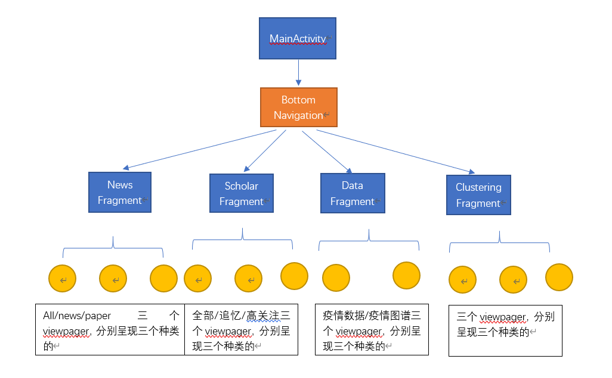

## 2020年夏季Java小学期大作业

2018013443 陈新

2018013429 郭沛辰   

### **1**    **代码结构**

描述代码整体框架，各部分作用以及具体实现人员。

本次作业两人分为前后端，郭沛辰负责后端，陈新负责前端。

##### 前端部分（陈新完成）

整体框架如上图所示，还有触发的**search页面、详情显示页面、绘制图表页面等等**没有在图中表现出来，但大致逻辑是没错的。

主界面由底部导航栏导航到 **新闻、知疫学者、数据、新闻聚类** 四个fragment，若干fragment里面有viewpager等组件管理子fragment。

数据请求我们解耦合做的非常好，我作为前端只需要调用rxjava的接口，发出请求数据的命令并使用observer等待数据更新即可，然后就能绘制页面、进行下一步的逻辑操作。

##### 后端部分（郭沛辰完成）

| 类名            | 功能                                                         | 父类        | 子类 | implement                 |
| --------------- | ------------------------------------------------------------ | ----------- | ---- | ------------------------- |
| Constants       | 全局常量类，内部是全局静态常量                               | NA          | NA   | NA                        |
| DataPerDay      | 内有四个变量，分别是日期和确诊、死亡、治愈人数               | NA          | NA   | Serializable              |
| Entity          | 承载实体的数据                                               | NA          | NA   | NA                        |
| EpidemicData    | 内有DataPerDayd的List和开始日期，记录某地从爆发开始到现在的情况 | NA          | NA   | Serializable              |
| EpidemicDataMap | 内有所有国家地区命的列表和从地区名到EpidemicData的映射       | NA          | NA   | NA                        |
| MyString        |                                                              | NA          | NA   | NA                        |
| NewsPiece       | 存储一条新闻/事件/论文应有的各种信息                         | SugarRecord | NA   | Serializable              |
| NewsList        | 内有一个NewsPiece的列表和若干接口                            | NA          | NA   | NA                        |
| Relation        | 实体间的关系                                                 | NA          | NA   | NA                        |
| Scholar         | 内有学者应有的各类信息，代表一个学者                         | NA          | NA   | Serializable， Comparable |
| SearchHistory   | 搜索历史，内有一个String类的搜索历史和时间戳                 | SugarRecord | NA   | NA                        |
| ClusterServer   | 提供获得聚类信息的接口                                       | NA          | NA   | NA                        |
| DataServer      | 提供获得疫情数据的接口                                       | NA          | NA   | NA                        |
| EntityServer    | 提供获得实体数据的接口                                       | NA          | NA   | NA                        |
| NetWorkServer   | 提供获取新闻数据的接口和为其他类提供网络服务                 | NA          | NA   | NA                        |
| ScholarServer   | 提供获取学者数据的接口和                                     | NA          | NA   | NA                        |
| Search          | 提供搜索的接口                                               | NA          | NA   | NA                        |

后端一共向前端提供了两个获取NewsList的静态方法：一个是refresh，对应前端的下拉刷新新闻的操作；另一个是loadMore，对应前端的上拉加载更多新闻的操作。前者是重新获得一个从头开始的newslist，后者是在当前条目的基础上再拉取一个NewsList附加到原来的后面，因此需要为每个类别维护一个当前条目数。这个条目是最新的最大，为当前总数，越老的条目数越小，最小是1。这样一来对于每个条目都由唯一不变的一个条目数，这样我就可以通过维护条目数记住我当前读到的位置，从而不重不漏地加载固定数量的新闻。

在前后端交互问题上，为了让前后端耦合度尽可能的低，让前端尽可能地不要管任何后端的事情，我选择了用第三方库RxJava来进行前后端交互。在后端我提供的异步接口都会重载一个Observable类，在其中的subscibe方法中拉去 NewsList然后通过emmiter在onNext函数中把它传给前端：（以loadMore函数举例）

~~~java
public static void loadMore(Observer<NewsList> ob, final String type){
        Observable.create(new ObservableOnSubscribe<NewsList>() {
            @Override
            public void subscribe(ObservableEmitter<NewsList> emitter) throws Exception {
                NewsList list = NetWorkServer._viewOldExcuteNew(type);//私有静态函数，避免暴露给前端
                    //System.out.println("下拉: " + NetWorkServer.getPageNum() + " " + NetWorkServer.getCount());
                emitter.onNext(list);
                emitter.onComplete();
            }
        }).subscribeOn(Schedulers.io()) //在io执行上述操作
                .observeOn(AndroidSchedulers.mainThread())//在UI线程执行下面操作
                .subscribe(ob);
    }
~~~

而前端在调用这个接口的时候需要重载一个Observer类，并在其onNext函数中获取我发送的NewsList，然后可以进行进一步操作：(以被loadMore订阅的observer为例)：

~~~java
newsListObserver = new Observer<NewsList>() {
            @Override
            // 绑定激活函数
            public void onSubscribe(Disposable d) {}

            @Override
            public void onNext(NewsList newsList) {
                if (refreshMode == RefreshMode.REFRESH) {
                    newsInfo.clear();
                    if (newsList.getNewsList().isEmpty())
                        Toast.makeText(getContext(), "无搜索结果", Toast.LENGTH_SHORT).show();
                }
                newsInfo.addAll(newsList.getNewsList());
            }

            @Override
            public void onError(Throwable e) {
                Toast.makeText(getContext(), "加载失败", Toast.LENGTH_SHORT).show();
                if (refreshMode == RefreshMode.REFRESH)
                    refreshLayout.finishRefresh();
                if (refreshMode == RefreshMode.LOADMORE)
                    refreshLayout.finishLoadMore();
            }

            @Override
            public void onComplete() {
                arrayAdapter.notifyDataSetChanged();
                if (refreshMode == RefreshMode.REFRESH)
                    refreshLayout.finishRefresh();
                else if (refreshMode == RefreshMode.LOADMORE)
                    refreshLayout.finishLoadMore();
            }
        };
~~~

同时我提供了一个通过单个id来获取单个NewsPiece的异步方法loadNewsPiece，在前端点击新闻详情时会调用这个接口，传给后端一个id，然后我单独拉取该id的NewsPiece返回给前端。

在浏览记录的实现上我用了第三方库SugarORM（但体验太差了）。我在NewsPiece中维护了一个boolean变量isRead用来表示此条新闻是否读过，它的缺省值为false。每次当他发一个id给我去拉单个newspiece时，我会把这个NewsPiece存入数据库，然后返回给他一个isRead是true的一个NewsPiece。当前端请求的时候，我会在数据库中检查有没有对应id的NewsPiece，如果由就从数据库中调取放回，如果没有就从网上拉一个并将其加入数据库。并且每当我传给前端NewsList之前都会检查一遍所有NewsPiece元素是否在库里并更改isRead值。

##### 2.搜索与搜索历史

和获取新闻列表类似，只是这回会多传进来一个搜索内容。我会在相应的类型的条目的标题，正文，来源和日期中匹配搜索内容，如果搜索到了就将其加入List\<NewsPiece\> 中。在规定的最大搜索条目上限(SEARCHMAX)内如果搜索List的大小达到了预定大小，返回，否则会在到达最大搜索条目上限时返回，不论有没有搜到。

为了使用SugarOrm，我创建了一个SearchHistory类，其中维护了一个String存储记录，维护了一个timestamp可以时间顺序。每次搜索的时候都会把查看当前搜索记录是否存在与数据库中，如果存在，则将其时间戳更新为现在的时间戳；如果不存在，则以当前时间戳存入数据库。

搜索和搜索记录我放入了Search类，其中实现了四个前端可见的接口。

search和searchRefresh一个是第一次搜索，一个是上拉加载更多搜索内容，其实现和新闻列表的刷新和加载逻辑很像。

getHistory会返回一个最大SEARCHHISTORYSIZE大小的List，其中先搜索的在后面，后搜索的在前面。

同时我实现了一个清空历史记录功能，但没有必要反映在前端，就没做。

##### 3.疫情数据

实现了一个DataPerDay记录日期以及当天的确诊，死亡和治愈人数。

实现了EpidamicData类来承载一个地区的数据，其中维护了一个 List\<DataPerDay\> \_data来存储每天的数据，一个\_outbreakDate来存储该地疫情爆发时间，一个\_total记录outbreak到最后更新的天数，方便运算。其中对外除了一个参数为JSONObject对象的构造函数外就是一个可以返回最后更新时间向前n天的DataPerDay的方法getData。同时实现了一系列私有函数来实现字符串日期的加减

实现了EpidamicMap类，其中维护了一个地区名到EpideData的Map和存有每个有数据的地区的名字的List，其中是实现了一个传入地区名和天数n返回该地区从今天其向前n天的DataPerDay。

由于这个json有点大，如果每次查询都要在线拉取会很慢，所以在NetworkService中实现了下载数据的json文件的downloadEpidemicDataMap到本地和在DataServer中实现的把国家地区名的json存入本地的writeNameListJSON方法。每次开启程序的时候都会调用这个方法，在三秒内更新完本地文件。

在DataServer中实现了readNameListJSON方法可以传给前端一个Map\<String, Map\<String, List\<String\>\>\>用来构建国家地区选单。然后再由这个选单构成一个String作为地区名调用getDataPerDay来获取一定天数内的DataPerDay。

##### 4.疫情实体

实现了Entity类承载实体数据，其由一个JSONObject创建。

实现了EntityServer内的两个静态方法。一个是getEntity通过一个name来获得准确的实体，一个是getEntityData通过一个name来获得相关实体列表。前者是因为serializable无法传输大量信息，当点到一个实体的详情页面的时候可能会因为内部的relation过多导致崩溃，所以前端得再次通过实体labeel向后端请求数据。

##### 5.知疫学者

实现了Scholar类承载实体数据，其由一个JSONObject创建

实现了ScholarServer类的静态方法getScholarList获得一个scholar的list。

##### 6.事件聚类

 我先通过python将json扒下来，然后把每条event都处理成id.txt放在同一个目录下，里面的内容是segtext。

接着从网上找到了一个常用禁用词表，把所有id.txt内的词加入到一个集合，然后刨去禁用词表里有的词，再把它转为one-hot式的词向量，然后再把它转为tfidf词向量。

接着进行通过随机初始点的kmeans算法分类，发现当分3-4类时效果较好。然后我输出每个类里权重高的词，发现分四类时总有两类时相近的，所以我认为分三类时比较好的选择。于是又进行了几次3类的随机初始点的kmeans分类，选出其中反复出现的三类共有高频词，比如“新冠”“病毒""新冠病毒“之类的词加入禁用词表，再次随机初始点分类，发现三类之间的界限更加清晰。

于是我通过在事件中寻找尽可能多地包含关键词的事件，最后找到了三条作为初始点，再进行给定初始点的kmeans，得到了划分比较明朗的聚类事件，通过高频词分析，起名为”防控与传播“、”病理和机理”、“治疗与药物“三个大类。

我所用的kmeans算法是比较基础的一种，计算的距离是余弦距离而不是几何距离，因为根据实验余弦距离的效果要好于欧式距离，或许是因为这些类本身就已经比较明确了，所在的空间比较拥挤，用欧氏距离区分的难度大。

接着我把写有这三个类新闻id的txt放入了asset资源目录，然后实现了ClusterServer中静态方法getCluster和refreshCluster，其原理和NewsList的上拉刷新和下拉刷新类似，只是下拉刷新不会更新而已。

### **2**    **具体实现**

详细介绍项目分工，每个人的工作，突出工作的难点和亮点。 

#### **郭沛辰**

1.  新闻列表
   - 可以在线地获取内容：用到了okHttp这个第三方库 
   - 可以通过单一或多个关键词（多个关键词之间是或关系）获取在线内容
   - 可以通过refresh和loadMore加载信息，一次加载PAGESIZE条，不满就全部加载，加载老新闻不会重复加载
   - 使用SugarORM实现阅读过的新闻内容可以离线阅读
   - 可以通过rxjava向前端传输数据
   - 可以正确标记出那个NewsPiece是读过的，并发给前端 
2. 疫情数据
   - 可以根据前端发送的地区名和天数n返回距今n天的疫情数据
   - 可以向前端发送用来构建下拉框的地名映射结构
3. 搜索：
   - 可以通过接受前端数据在线查询并返回内容
   - 可以存储搜索记录，最新的会放在最上面且不会有重复
   - 实现加载更多搜多内容，且加载内容不会和已有内容重复
4. 实体
   - 实现接受前端数据返回实体数据
5. 学者
   - 实现接受前端数据返回学者数据
   - 实现高关注学者和追忆学弟的分类
   - 实现学者的部分前端内容
6. 聚类：
   - 通过python实现事件聚类，并通过增加禁用词和手动选择起始点的方式较好的分出了三类
   - 实现向前端传输聚类信息
   - 实现聚类的部分前端内容

#### 陈新

1. 所有的UI、进程间通讯、前端逻辑等全部由我完成，详见**“代码结构”**模块
2. 数据的通信，采取rxjava，用observer等待数据传输进来，再调用相应的onNext/onError/onComplete等待函数进行数据的操作。对这种多线程操作的理解加深了一些
3. 在疫情数据页面，用hellocharts库写图表
4. viewpager的动态增删标签添加，是安卓官方库本身不太支持的。但是通过一定的操作成功实现了动态增删viewpager的fragments的功能。而且在应用第三方库
5. 完成search等activity间的通讯。从全部利用Intent传递数据发现数据传递量有限而且非常慢，逐渐摸索，最后使用传递数据索引，在新activity中再用observer请求数据。
6. 为了更加userfriendly，我在写前端时非常注重界面的连续性、尽量减少界面的析构与重新加载，套用了很多fragment与androidx的新内容，但是这些内容在官网上的参考文档都非常少，不管内外网对此的讨论都很少，很多踩的坑也有人踩到，但是很少人写出解决方法。在这方面花的时间特别多。比如fragment的intent通信、fragmentmanager的调用等等。同时手撸代码重写了导航栏
7. 控件的点击等事件的监控互相block逻辑的编写，如增删分类列表的window点击事件block其他组件，和维护程序不被极端操作搞崩而进行的安全措施，如连续点击多次新闻列表不能弹出多个详情页面

### **3**    **总结与心得**

总结下自己的工作，谈一下过程中的收获以及对这个project的意见，方便我们以后改进。

#### 郭沛辰

- 了解了前后端分离的开发模式，这种高度分离的工作模式还是之前我没遇到过的，学到很多。
- 同时也体验了github的版本管理
- 小心第三方库，尤其是那种找不到官方文档的第三方库。后端表示四分之一的时间都在和SugarORM斗智斗勇

#### 陈新

- 这是我接触计算机接触编程以来第一次前后端分离的经理，但我们认为我们做的非常好。与很多小组不同，有些小组是按照不同功能分锅的，这就会使得两人写出的前后端代码逻辑可能都不太相似，维护起来就很难。我们觉得这次大作业是一次很好的锻炼软件工程能力的机会，所以进行了前后端分离，起到了很好的效果。在项目刚开始的时候，我写了一点点后端，项目快结束的时候，郭沛辰同学也帮助我写了一点前端，所以也算是锻炼了我们前后端both的能力，也没偷懒233
- github的版本管理非常方便，但是进入计算机系以来从来没有学过，这还是我们第一次接触，但我认为可以教一下大家，省时省力。
- 第三方库不可信，我作为前端，尝试用了一些第三方库，在提供了一些便利的同时，它也带来了非常多的难题，很多第三方库本身的代码实现逻辑是有问题的，花了很长时间找到了bug，只能把源码下下来添加进自己的项目，再修改。
- 课程上教的内容大多与java相关，很多非常有用，例如java“==”和equal的区别，我利用这些知识，加上自己编写测试代码，否决自己了很多不成熟的想法，节省了很多时间。但同时也感觉android相关内容过少了，写程序完全是摸石头过河。我此前没接触过安卓编程，对前端的第三方库的了解少之又少，手撸了很多代码才知道很多第三方库可以轻松解决，建议对这些相关内容可以更多地介绍一下

